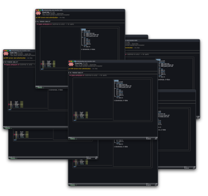

# frame

[](https://github.com/scoop206/frame/actions/workflows/test.yml)

An opinionated AI harness based around:

- neovim
- git worktrees



Run from inside any project checkout:

```
frame init                 scaffold .frame/config.sh, gitignore .frame/local/
frame wt TOPIC             create/reuse branch TOPIC + worktree ../_<name>-TOPIC, boot it
frame wt                   boot the worktree you're already in
frame wt -d [-f] [TOPIC]   tear down a frame (defaults to the one you're in)
frame shell TOPIC          casual frame in ~/frames/TOPIC — no repo, no branch,
                           just the claude + local buffers
frame merge [TOPIC] [--push|--ff|-n]   merge into main from the primary worktree
frame services [up|down|ps]            manage the shared postgres/minio stack
frame status [TEXT…]       append "- TEXT" to this frame's window title (no TEXT clears)
frame notify [TEXT…]       macOS banner + the same title status (default "⏸ waiting")
```

`worktree` is accepted as a synonym for `wt`.

### Frames

A frame is a terminal window running neovim as it's buffer management layer.
This is usually one buffer running Claude and then whatver else is appropriate.
Frames assumes a 1:1:1 mapping between a frame:worktree:branch.

All work happens in topic worktrees, each are self-sufficient peer — `frame wt` runs the
project's idempotent `stack_up()`, so whichever frame boots first brings up
the shared services.

`frame wt TOPIC` is the typical entrypoint.

For example:
This starts neovim w/ custom layout which is usually 4 buffers:

- claude - starts claude-code
- vite - cd web && npm run dev
- server - cargo run -p $PROJECT-server
- local - bare terminal

The ghostty window will now be named $REPO/$TOPIC:PORT
You can see vite's rendered web app at http://localhost:PORT

When you are done working on the feature you (or claude) can merge to main:

```
frame merge
```

### Vim commands

When frame instantiates the nvim instance it injects these user commands
(defined in `layouts/worktree.lua`), available from any buffer in the session:

| command              | action                                                                        |
| -------------------- | ----------------------------------------------------------------------------- |
| `:FrameStatus TEXT…` | append "- TEXT" to the window title's status suffix (no TEXT clears it)       |
| `:FrameNotify off`   | mute `frame notify` banners for this session (`on` unmutes, bare shows state) |
| `:FrameQuit`         | quit the session only — worktree and branch stay for a later `frame wt TOPIC` |
| `:FrameDown`         | tear down the whole frame: quit nvim, remove the worktree, delete the branch  |
| `:FrameDown!`        | force teardown — discard uncommitted changes and unmerged commits             |

In a casual frame (`frame shell`) `:FrameDown!` quits and deletes the topic
directory; plain `:FrameDown` always refuses, since nothing there is under git.

### Status

The window title's base — `$REPO/$TOPIC :PORT` — never changes, but you can
append a free-text status to it so parallel frames show where they're at:

- in any terminal buffer (including claude): `frame status DEPLOYED. Waiting verification`
- in nvim: `:FrameStatus DEPLOYED. Waiting verification`

Either with no text clears back to the base title.

The CLI form works by RPC over the frame's nvim socket (nvim owns the title),
so it also works from outside the frame while its session is up.

### Notifications

`frame notify [TEXT…]` pings you on both channels at once: a macOS banner
(titled `$NAME/$TOPIC`, so parallel frames are tellable apart) plus the same
window-title status as `frame status`. Both are best-effort and it always
exits 0, so it's safe as a hook target.

`frame init` wires it into a project's `.claude/settings.json`:

- **Stop** → `frame notify` — every time claude ends a turn you get a banner
  and the title gains "- ⏸ waiting"
- **UserPromptSubmit** → `frame status` — sending the next prompt clears the
  status back to the base title

When a frame gets too chatty — a long conversational session, say — mute it
with `:FrameNotify off` (`on` unmutes; bare `:FrameNotify` shows the state).
The switch lives in that session's nvim and dies with it, so each parallel
frame mutes independently and every frame boots unmuted. `frame notify` asks
the session over its socket before popping the banner; only the banner+sound
is muted — the window-title status still updates, so a muted frame still
shows "- ⏸ waiting" when claude finishes.

Beyond the mute switch there's one automatic filter: quick conversational
turns don't banner. Sending a prompt stamps the turn start (the
UserPromptSubmit hook above), and `frame notify` skips the banner when the
prompt was 10 seconds ago or less — you just asked, you're still looking at
the frame. Turns long enough to have walked away from banner as before, and
the "- ⏸ waiting" title status updates either way.

### Frame Removal

To merely close the session — keeping the worktree and branch for a later
`frame wt TOPIC` — use `:FrameQuit` (≡ `:qa!`).

Tear down from _inside_ the frame — either entry point works:

- in nvim: `:FrameDown`
- in any terminal buffer: `frame wt -d`

Both hand the teardown to a detached reaper rooted in the primary checkout.
It sends `:qa!` to the nvim session (works from terminal-insert mode, and the
`!` bypasses vimrc quit guards), waits for nvim to actually exit, then removes
the worktree and deletes the branch.

From outside (base terminal or another frame): `frame wt -d TOPIC`.

Teardown refuses if the worktree has uncommitted changes or the branch has
commits not yet on main — merge first (`frame merge`), or force with
`frame wt -d -f [TOPIC]` / `:FrameDown!`. These checks run _before_ nvim is
quit, so a refusal never leaves you editor-less. Reaper output lands in
`/tmp/<name>-<topic>.teardown.log`.

### Install

Clone this repo alongside your projects.  
put `/path/to/frame/bin/` on your PATH.  
add a .frame directory to the projects w/ optional components see below.

### Dependencies

- zsh
- git ≥ 2.5
- neovim (no plugins required)
- claude (Claude Code CLI) — WARNING: `--dangerously-skip-permissions` is always on
- docker with the compose v2 plugin
- macOS + OrbStack (any docker provider works if already running; auto-start is OrbStack-only)
- curl, lsof

Needed only by specific commands or buffers:

- node + npm (the `vite` buffer, when the project has `web/`)
- ngrok (optional; prefilled, never auto-run)
- ghostty + Raycast (optional; window fuzzy find)

## How a project plugs in

Everything project-side lives under one `.frame/` directory:

| path                  | committed?         | contents                                                                   |
| --------------------- | ------------------ | -------------------------------------------------------------------------- |
| `.frame/config.sh`    | yes                | project facts: NAME, ports, SERVER_CMD, BUFFERS, `stack_up()`, `app_env()` |
| `.frame/worktree.lua` | optional           | project-level layout override                                              |
| `.frame/local/`       | never (gitignored) | personal overrides — `config.sh`/layouts here win                          |

One setting is required: `BUFFERS=(…)` — which buffers this project's frames
open (see Buffers below). Everything else is optional. Hooks:

- `stack_up()` — bring up whatever the dev stack needs. Runs on every `frame wt`
  boot, so keep it idempotent. Shared postgres/minio come from
  `frame_services_up` / `ensure_pg_db` / `ensure_minio_bucket`; only
  project-unique containers belong in the project's own compose file — pin
  those with `--project-directory "$MAIN_WT"` so every frame shares one
  instance instead of spawning a per-worktree compose project.
- `app_env()` — export the vars pointing the app at what frame set up: the
  shared services (`DATABASE_URL`, S3 endpoint, …) and, if your app reads its
  port under a name other than the `PORT` frame tracks (see `buffers.json`),
  a re-export of it here (e.g. `export SERVICE_PORT="$PORT"`). Exported vars
  win over `.env` (dotenvy never overrides the environment).

See [`examples/`](examples) for complete `.frame/` directories at three
sizes — name-only, the standard web stack, and a project running its own
container.

## Buffers

[`buffers.json`](buffers.json) (frame root) is the registry of every terminal
buffer a frame can open — the formal superset. Per entry:

| field     | meaning                                                                                                                                       |
| --------- | --------------------------------------------------------------------------------------------------------------------------------------------- |
| `name`    | buffer name (shown in `:ls`, targeted by `BUFFERS`)                                                                                           |
| `mode`    | `durable` auto-runs and drops to a shell on exit (↑ + Enter reruns); `prefill` types the command without running it; `bare` is an empty shell |
| `command` | the command the buffer runs                                                                                                                   |
| `dir`     | subdirectory to run in                                                                                                                        |
| `env`     | vars the command reads — a declared contract; frame warns at boot if unset                                                                    |
| `focus`   | land here after boot                                                                                                                          |

`BUFFERS=(…)` in `$PROJECT/.frame/config.sh` is required, and authoritative
even when empty:

| `BUFFERS` in `$PROJECT/.frame/config.sh` ? | result                                    |
| ------------------------------------------ | ----------------------------------------- |
| not set                                    | `frame wt` refuses to boot                |
| `BUFFERS=(claude server local)`            | those buffers, as defined in the registry |
| `BUFFERS=()`                               | no buffers                                |

A buffer whose command can't run (no `web/`, unset env var) fails inside
that buffer, visibly — fix the config or drop it from `BUFFERS`. One
exception: a buffer whose command comes up empty (say `server` with no
`SERVER_CMD`) opens as a bare shell.

All definitions live in frame's `buffers.json` — there is no project-level
registry. A project needing a one-off buffer (say a sidecar's log tail) gets
its definition added there and lists it in its `BUFFERS`; no other project
is affected. Names in `BUFFERS` must match registry entries; unknown names
are skipped with a boot warning.

## Shared services

`services/docker-compose.yml` runs one postgres (`:5432`) and one minio
(`:9000`/`:9001`) for all projects — multi-tenant via databases/roles and
buckets, standard ports, no per-project offsets. Helper functions in
`lib/helpers.sh` create roles/databases/buckets idempotently.

## Windows

Every frame titles its ghostty window — `name/topic :port` — so Raycast's
window search can fuzzy-find
any of them. The title is set from the shell before nvim launches, then owned
by nvim (`title` + `titlestring`) for the session.

## License

[MIT](LICENSE)
