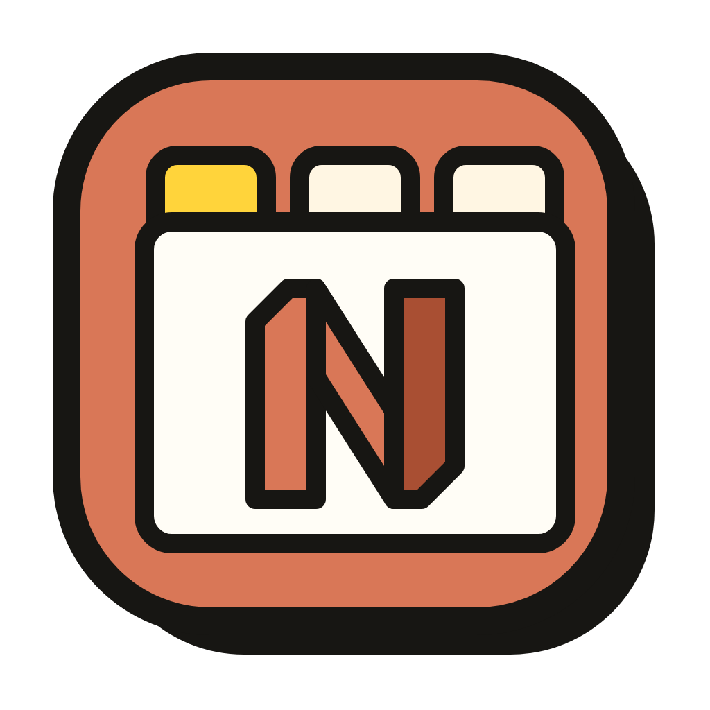

# frame

[](https://github.com/scoop206/frame/actions/workflows/test.yml)

frame - an AI harness built on: zsh, ghostty, neovim, and claude code

<p align="center">
  
</p>

<!-- Record with: vhs assets/demo.tape  (see assets/demo.tape) -->
<p align="center">
  
</p>

## Table of Contents

- [What Frame does](#what-frame-does)
- [Features](#features)
- [Installation](#installation)
  - [Prerequisites](#prerequisites)
  - [Install Frame](#install-frame)
  - [Recommended extras](#recommended-extras)
- [Getting Started](#getting-started)
- [Concepts: Frames](#concepts-frames)
- [Vim commands](#vim-commands)
- [Frame Merge](#frame-merge)
- [Frame Removal](#frame-removal)
- [Notifications](#notifications)
- [Swarm: telling agents they're in a frame](#swarm-telling-agents-theyre-in-a-frame)
- [How a project plugs in](#how-a-project-plugs-in)
- [Buffer Definitions](#buffer-definitions)
- [Shared (Centralized) Services](#shared-centralized-services)
- [License](#license)

## What Frame does

Everyday commands — run `frame <command> --help` for flags, or `frame --help`
for the full list:

| command                      | what it does                                           |
| ---------------------------- | ------------------------------------------------------ |
| `frame init`                 | scaffold frame into a project (`.frame/*`, hooks)      |
| `frame wt TOPIC`             | create/reuse a branch + worktree, boot it              |
| `frame wt`                   | boot the worktree you're already in                    |
| `frame wt -d [TOPIC]`        | tear down a frame (default: the current one)           |
| `frame shell TOPIC`          | a frame with no repo — just the claude + local buffers |
| `frame ls`                   | list every live frame across projects                  |
| `frame merge [TOPIC]`        | merge a topic branch into main                         |
| `frame claude TEXT…`         | ask this frame's claude, block for the answer          |
| `frame req NAME/TOPIC TEXT…` | ask another frame's claude (async)                     |
| `frame inbox`                | read replies routed back to you                        |
| `frame services up`          | bring up the shared postgres/minio stack               |
| `frame focus [TOPIC]`        | raise a frame's window                                 |
| `frame yolo on\|off`         | toggle `--dangerously-skip-permissions` everywhere     |
| `frame swarm [off\|1\|2]`    | how much each frame's claude knows it's a frame (def 0) |

`worktree` is a synonym for `wt`; `list` for `ls`. Not shown here: `spawn`,
`deliver`, `reply`, `view`, `status`, `notify`, `notification`, and every
`--flag` — see `frame --help`.

### Inbox filtering

When you send a `frame req`, Frame prints a **token** (`token: frame/topic#id`) — a
globally-unique id for that request. Your inbox is shared: replies from every
`frame req` you've fired land there together, so reading in order can't guarantee
you're looking at the answer to a _specific_ request.

Pass `--for <token>` to `frame inbox` to retrieve only the reply for that request:

```bash
frame inbox --for frame/comms2#r7        # just that one answer
```

`--for` is repeatable, which makes it a fan-in barrier for correlated fan-out:
fire N reqs, capture each `token:` line, then wait for exactly those N answers —
unrelated mail landing mid-wait is left behind, not counted:

```bash
frame inbox --wait --for $t1 --for $t2   # blocks until both r1 and r2 arrive
```

See [docs/claude-broker.md](docs/claude-broker.md) for the full model.

## Features

- A frame per feature
- Parallel sessions you can tell apart
- notifications when claude is
- Shared postgres + minio (or whatever) across all your projects
- minimal neovim, zsh, git worktrees

## Installation

### Prerequisites

- zsh
- git ≥ 2.5
- neovim (no plugins required)
- claude (Claude Code CLI) — permission prompts stay on unless you opt in with `frame yolo on`
- docker with the compose v2 plugin
- macOS + OrbStack (any docker provider works if already running; auto-start is OrbStack-only)
- curl, lsof

Frame also assumes **every project's default branch is named `main`**.

### Install Frame

```bash
# 1. Clone Frame — location doesn't matter
git clone https://github.com/scoop206/frame.git
cd frame

# 2. Put frame on your PATH (this line persists it in ~/.zshrc)
echo "export PATH=\"$PWD/bin:\$PATH\"" >> ~/.zshrc
exec zsh

# 3. Verify
frame --help
```

### Recommended extras

- **Ghostty ≥ 1.3** — the terminal Frame was built with; on others your YMMV.
  1.3+ ships an AppleScript dictionary that Frame uses for the good spawn
  UX: workers congregate as tabs in a shared window, `frame focus` selects
  the exact tab by id, and ephemeral workers reap their own tabs. On older
  Ghostty (or if scripting fails) every spawn opens a separate app instance —
  it works, and `frame spawn` tells you when it fell back.

  **Automation permission:** Ghostty scripting itself needs no grant, so
  frames spawning frames just works. Running frame commands from _another_
  app (a different terminal, Raycast, the notify banner) makes macOS prompt
  once — "… wants to control Ghostty" — allow it. If it was dismissed or
  denied: System Settings → Privacy & Security → Automation, or
  `tccutil reset AppleEvents <bundle-id-of-the-caller>` to re-prompt.

- **Raycast** — window fuzzy-find lets you leverage the waiting and TOPIC name of your frames.
- **homebrew + terminal-notifier** — optional; `brew install terminal-notifier`,
  then `frame notification init` (or the first `frame init`) builds the frame-icon,
  click-to-focus banner app (without them, plain osascript banners still fire).

## Getting Started

From inside any project, scaffold its Frame config and start a worktree:

```bash
cd your-project

# 1. Scaffold .frame/config.sh and gitignore .frame/local/
frame init

# 2. (optional) let Claude run with permissions skipped in every frame
frame yolo on

# 3. Create a topic worktree and boot it
frame wt scratch-topic
```

Neovim will fire up with the Claude buffer in the foreground.

A bare-bones `.frame/config.sh` needs only your buffer list — if you'd rather write
it by hand instead of running `frame init`:

```bash
cd your-project && mkdir -p .frame && echo "BUFFERS(claude local)" > .frame/config.sh
```

See [How a project plugs in](#how-a-project-plugs-in) for the full config.

## Concepts: Frames

A frame is a terminal window running neovim as its buffer management layer (multiplexer).
This is usually one buffer running Claude and then whatever else is appropriate.
Frames assumes a 1:1:1 mapping between a frame:worktree:branch.

All work happens in topic worktrees, each a self-sufficient peer — `frame wt` runs the
project's idempotent `stack_up()`, so whichever frame boots first brings up
the shared services.

Worktrees are created beside the primary checkout as `../_<name>-<topic>`.
The leading underscore marks them as frame-managed and keeps them sorted
together in the parent directory; frame also parses the name to infer the
topic when you run `frame wt` (or `frame wt -d`) from inside one.

`frame wt TOPIC` is the typical entrypoint.

For example:
This starts neovim w/ custom layout which is usually 4 buffers:

- claude - starts claude-code
- vite - cd web && npm run dev
- server - cargo run -p $PROJECT-server
- local - bare terminal

The ghostty window will now be named `$REPO [ $TOPIC :PORT ]`
You can see vite's rendered web app at http://localhost:PORT

## Vim commands

When frame instantiates the nvim instance it injects these user commands
(defined in `layouts/worktree.lua`), available from any buffer in the session:

| command                   | action                                                                                                              |
| ------------------------- | ------------------------------------------------------------------------------------------------------------------- |
| `:FrameStatus TEXT…`      | append "- TEXT" to the window title's status suffix (no TEXT clears it)                                             |
| `:FrameNotify off`        | 'on' or 'off' to unmute/mute banners; no arg shows state                                                            |
| `:FrameQuit`              | quit the session only — worktree and branch stay for a later `frame wt TOPIC`                                       |
| `:FrameDown`              | tear down the whole frame: quit nvim, remove the worktree, delete the branch                                        |
| `:FrameDown!`             | force teardown — discard uncommitted changes and unmerged commits                                                   |
| `:FrameMerge`             | merge this frame's branch into main (same safeguards as `frame merge`)                                              |
| `:FrameMerge!`            | merge, then push main to origin (mirrors `frame merge --push`)                                                      |
| `:[range]FrameClaude [Q]` | ask this frame's claude about the current line / visual selection; answer opens in a `[FrameClaude]` scratch buffer |

In a shell frame (`frame shell`) there is no worktree or branch, so
`:FrameDown` simply quits and deletes the topic directory — the safeguards
below don't apply, and the bang changes nothing. `:FrameQuit` keeps the
directory for a later `frame shell TOPIC`.

### Asking claude from the editor — `:FrameClaude`

`:FrameClaude` is the in-editor sibling of `frame claude`: it asks **this
frame's** claude about the code you're looking at, without leaving the buffer.

- **Bare `:FrameClaude`** sends the current line; **`:'<,'>FrameClaude`** (or any
  `:[range]`) sends the selected lines. The file and line range are attached as
  context, so claude knows what it's looking at.
- **`:FrameClaude <question>`** asks your own question about that code; with no
  question it defaults to "Review this code and give feedback."
- The reply renders in a reusable, read-only `[FrameClaude]` markdown scratch
  buffer that opens in a right-hand split (your cursor stays in the code). It
  shows a placeholder while claude works, then rewrites in place with the answer.

It shares the same broker and the same single claude conversation as
`frame claude` — so these turns enter that conversation like any other, and a
question asked while claude is busy simply queues. Unlike the socket clients, the
answer is pushed back in-process (no polling), so there's nothing to await. See
[docs/claude-broker.md](docs/claude-broker.md).

## Frame Merge

When you are done working on the feature you (or claude) can merge to main —
from wherever you are:

```
frame merge                merge the current worktree's branch
frame merge TOPIC          merge branch TOPIC
frame merge TOPIC --push   …and push main to origin afterward
frame merge --ff           fast-forward instead of a merge commit
frame merge -n             dry run: print the plan, change nothing
```

The worktrees share one object store, so the primary checkout already sees
every topic branch. `frame merge` drives that primary worktree via `git -C`:
fast-forward main to origin, merge the topic branch, and (only when asked)
push — all without leaving whichever worktree you're in.

From inside the session, `:FrameMerge` runs the same thing for the current
frame's branch (`:FrameMerge!` also pushes); a blocked merge reports the
reason without leaving nvim.

Safeguards, in the order they run:

- **Primary must be clean** — refuses if the primary worktree has uncommitted
  tracked changes on main.
- **Uncommitted topic work is flagged** — only the committed branch tip gets
  merged, so a warning calls out anything uncommitted in the topic worktree
  that would be silently left out.
- **No guessing on divergence** — main is brought level with origin first
  (fast-forward only); if main and origin have diverged, it stops and leaves
  the reconciliation to you.
- **Conflicts stop cleanly** — on a merge conflict it halts and prints the
  exact `merge --abort` to back out.
- **Push is opt-in** — nothing touches origin unless you pass `--push`.

Worktree and branch cleanup stays with `frame wt -d` (below).

## Frame Removal

Tear down from _inside_ the frame — either entry point works:

- in nvim: `:FrameDown`
- in any terminal buffer: `frame wt -d`

From outside the frame — the project's primary checkout, or another frame of
the same project: `frame wt -d TOPIC`. TOPIC is resolved in the current
project's namespace, so you must run it from inside that project's git tree.

### Teardown Safeguards

Teardown refuses if the worktree has uncommitted changes or the branch has
commits not yet on main — merge first (`frame merge`), or force with
`frame wt -d -f [TOPIC]` / `:FrameDown!`. These checks run _before_ nvim is
quit, so a refusal never leaves you editor-less. Reaper output lands in
`/tmp/frame/<name>-<topic>.teardown.log`.

### Closing a window vs. tearing down

Just closing a frame's window or tab (⌘W, the close button) is **suspend**,
not delete — and it's always safe:

- The frame's dir (or worktree + branch) survives. `frame shell TOPIC` /
  `frame wt TOPIC` later picks the frame back up where it left off —
  claude's session files and your work intact. Only `:FrameDown` /
  `frame wt -d` actually deletes.
- Processes die with the surface: if claude was mid-turn that work is lost,
  no reply routes home, and a head blocked on `frame inbox --wait` for it
  runs to its timeout.
- Bookkeeping self-heals. The nvim socket dies with nvim; a stale spawn
  recording (`.gtab`) is detected and dropped by `frame focus`; the next
  `frame spawn` validates its workers-window recording before reuse.
- One special case: an `--ephemeral` worker closed by hand never gets to
  self-reap, so its dir lingers in `~/frames` like any other closed frame.

Rule of thumb: close freely to get a worker out of the way; `:FrameDown`
when the topic should be gone.

## Notifications

### Fixing the banner badge

At first the badge is a generic AppleScript badge — clicking it opens Script
Editor instead of focusing your frame. Things work fine in this state, but here
are the extra steps to get the badge right:

```bash
brew install terminal-notifier
```

Then build the Frame app icon for the banner with:

```bash
frame notification init
```

You should be prompted to allow for Frame to notify:

- System Settings → Notifications → Frame → Allow.

You can send a test notification with:

```bash
frame notify
```

If the new badge is still not working you can also try (they will respawn):

```
killall usernoted NotificationCenter
```

## Swarm: telling agents they're in a frame

By default a frame's Claude doesn't know it's in a frame — it behaves as a lone
worker, blind to its own identity and its siblings. `frame swarm` changes that
by injecting a short block at every session start. It's a **dial, not a
switch**: each level injects strictly more, so token cost and permitted
behavior grow together.

```bash
frame swarm            # show the current level
frame swarm off        # (= 0) no injection — the default
frame swarm 1          # aware
frame swarm 2          # ask
frame swarm singularity  # clamp to the highest built level, and say so
```

| level | what the agent is told |
| ----- | ---------------------- |
| **0 · off** | nothing (the default) |
| **1 · aware** | **who it is** — `NAME/TOPIC` + its dev-server URL, read from the frame's own environment (present only inside a real frame); and **the frame-safe way to act** — merge/tear down via `frame merge` / `frame wt -d` (not raw git), local merges are the agent's but pushing to origin stays with you, subagents it waits on run in the foreground, and a request from a sibling gets an answer, not an action. No sibling coordination. |
| **2 · ask** | level 1 **plus** a bounded recipe for asking sibling frames read-only questions (`frame req` → `frame inbox --wait --for`, with a per-turn budget and a 2-hop limit). Find who to ask with `frame ls`. |
| **∞ · singularity** | the ambitious top — lead-frame fan-out/gather. Not built yet: selecting it arms the highest real level and tells you the rest is dragons. |

Like `frame yolo`, it's a machine-global dial that takes effect on the next
frame boot (or `/clear`, resume, compact) — running sessions keep what they
started with. `on`/`off` are accepted as aliases for `1`/`0`. When off, the
injection is a no-op that costs nothing, so solo repos that never coordinate
don't pay for it. It's wired through a `SessionStart` hook that `frame init`
scaffolds into `.claude/settings.json`.

**Extending the block per project.** Define `swarm_context()` in
`.frame/config.sh` (or `~/.config/frame/config.sh`, or `.frame/local/config.sh`)
and its output is appended after the built-in core — a natural home for a
one-line "this frame owns X" or a shared-infra heads-up. The core safety rules
are never overridable, so an append can only add, never drop a rule.

```sh
# .frame/config.sh
swarm_context() {
  echo "This frame owns pactduo-infra — the shared pg (5432) + minio (9000)."
}
```

## How a project plugs in

Everything project-side lives under one `.frame/` directory:

| path               | committed?         | contents                                                                                                                           |
| ------------------ | ------------------ | ---------------------------------------------------------------------------------------------------------------------------------- |
| `.frame/config.sh` | yes                | project facts:<br>`NAME=`<br>`SERVER_CMD=`<br>`API_PORT=` `VITE_PORT=` `HMR_PORT=`<br>`BUFFERS=(…)`<br>`stack_up()`<br>`app_env()` |
| `.frame/local/`    | never (gitignored) | personal overrides — a `config.sh` here wins                                                                                       |

### config.sh

config: `NAME`  
required: yes  
value: the project name; window titles, worktree dirs, and PORT_PREFIX derive from it

config: `BUFFERS(...)`  
required: yes  
value: which buffers this project's frames open, e.g. BUFFERS=(claude local) — see Buffers below

Hooks:

- `stack_up()` — bring up whatever the dev stack needs. Runs on every `frame wt`
  boot, so keep it idempotent. Shared postgres/minio come from
  `frame_services_up` / `ensure_pg_db` / `ensure_minio_bucket`; only
  project-unique containers belong in the project's own compose file — pin
  those with `--project-directory "$MAIN_WT"` so every frame shares one
  instance instead of spawning a per-worktree compose project.
- `app_env()` — export the vars pointing the app at what Frame set up: the
  shared services (`DATABASE_URL`, S3 endpoint, …) and, if your app reads its
  port under a name other than the `PORT` frame tracks (see `buffers.json`),
  a re-export of it here (e.g. `export SERVICE_PORT="$PORT"`). Exported vars
  win over `.env` (dotenvy never overrides the environment).

## Buffer Definitions

Every buffer type a project can instantiate needs to be in the `buffers.json` Frame registry.

Per entry:

| field   | meaning                                                                    |
| ------- | -------------------------------------------------------------------------- |
| name    | buffer name (targeted by `BUFFERS`)                                        |
| mode    | `durable` auto-runs and drops to a shell on exit; `bare` is an empty shell |
| command | the command the buffer runs                                                |
| dir     | subdirectory to run in                                                     |
| env     | vars the command reads — a declared contract; frame warns at boot if unset |
| focus   | land here after boot                                                       |

## Shared (Centralized) Services

Within the Frame repo is `services/docker-compose.yml`. Helper functions in
`lib/helpers.sh` create roles/databases/buckets idempotently.

## License

[MIT](LICENSE)
