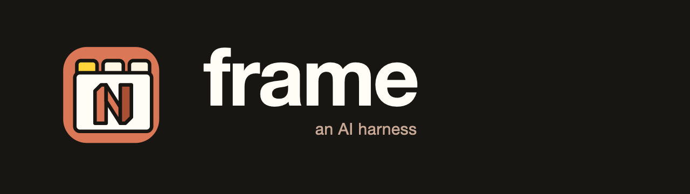

# frame

[](https://github.com/scoop206/frame/actions/workflows/test-macos.yml)
[](https://github.com/scoop206/frame/actions/workflows/test-linux.yml)

<p align="center">
  
</p>

<!-- Record with: vhs assets/demo.tape  (see assets/demo.tape) -->
<p align="center">
  
  <br>
  <sub><a href="https://www.youtube.com/watch?v=Z2tggjBM5w4">youtube demo</a></sub>
</p>

## Table of Contents

- [What Frame does](#what-frame-does)
- [Other Features](#other-features)
- [Getting Started](#getting-started)
  - [Prerequisites](#prerequisites)
  - [Install Frame](#install-frame)
  - [Onboarding a project](#onboarding-a-project)
- [Worktrees](#worktrees)
- [Vim commands](#vim-commands)
  - [Asking claude from the editor](#asking-claude-from-the-editor--frameclaude)
- [Frame Merge](#frame-merge)
- [Frame Removal](#frame-removal)
  - [Teardown Safeguards](#teardown-safeguards)
- [Notifications](#notifications)
  - [Fixing the banner badge](#fixing-the-banner-badge)
  - [Inbox filtering](#inbox-filtering)
- [Swarm: telling agents they're in a frame](#swarm-telling-agents-theyre-in-a-frame)
  - [Extending the swarm instructions](#extending-the-swarm-instructions)
- [How a project plugs in](#how-a-project-plugs-in)
  - [Examples](#examples)
  - [config.sh](#configsh)
  - [Port assignment](#port-assignment)
- [Buffer Definitions](#buffer-definitions)
- [Shared (Centralized) Services](#shared-centralized-services)
- [License](#license)

## What Frame does

- Treat Neovim like a multiplexer.
- A frame is a terminal running one Neovim instance provisioned with a named RPC socket so other frames and the CLI can drive it.
- Each frame has one Claude buffer.
- The frame CLI injects lua and puts a message broker in front of claude.
- frames join the pool and become discoverable via `frame ls`
- In addition to claude you will typically have services like Vite and or binary backend service running in their own buffers. Frame manages the port assignments so you can stand up a frame per worktree/Topic.  
  They are self contained and disposable: once a topic is merged (`frame merge`;`:FrameMerge`), tear the frame down (`frame wt -d`;`:FrameDown`). Merge and teardown are separate guarded steps to ensure a clean delivery back to main before frame disassembly.
- Ghostty is the intended terminal — window focus and spawn-into-tabs use its scripting — but a frame still runs in other terminals.

| command                      | what it does                                                                           |
| ---------------------------- | -------------------------------------------------------------------------------------- |
| `frame wt TOPIC`             | create/reuse a branch and worktree, boot it                                            |
| `frame wt`                   | boot the worktree you're already in                                                    |
| `frame wt -d [TOPIC]`        | tear down a frame (default: the current one)                                           |
| `frame shell TOPIC`          | a frame with no repo — just the claude and local buffers                               |
| `frame ls`                   | list every live frame across projects                                                  |
| `frame merge [TOPIC]`        | merge a topic branch into main                                                         |
| `frame claude TEXT…`         | ask this frame's claude, block for the answer                                          |
| `frame req NAME/TOPIC TEXT…` | ask another frame's claude (async)                                                     |
| `frame inbox`                | read replies routed back to you                                                        |
| `frame services up`          | bring up the shared services stack                                                     |
| `frame focus [TOPIC]`        | raise a frame's window                                                                 |
| `frame yolo on\|off`         | toggle `--dangerously-skip-permissions` everywhere                                     |
| `frame swarm [off\|1\|2]`    | how much frame context each frame's claude gets — 0 off · 1 aware · 2 ask (starts off) |

`worktree` is a synonym for `wt`; `list` for `ls`.  
Not shown here: `spawn`,
`deliver`, `reply`, `view`, `status`, `notify`, `notifications`, `silence`, and every
`--flag` — see `frame --help` ([full usage](docs/usage.md)).

## Other Features

- **Vim/Claude integration** - `:FrameClaude` allows for quick conversations and code analysis
- **Shared Services** - Databases and Object Stores can be stood up once in the frame repo and share their services between all your projects
- OS-level **Notifications** (macOS) - a banner when a frame has **Completed** its task, Needs **Attention**, or is **Blocked** — with the Frame icon and click-to-focus. On Linux the same pings arrive via `notify-send` (install `libnotify`), minus the icon and click-to-focus; see [Platform support](#platform-support).
- **swarm** - uses the SessionStart hook to inform all frame claudes that they are frames and how to find their siblings. See [Swarm: telling agents they're in a frame](#swarm-telling-agents-theyre-in-a-frame) for the per-level breakdown.
- **shell** - a thin (non worktree) frame for raw claude work
- **YOLO mode** to globally enable/disable `--dangerously-skip-permissions`. (Note: once changed, only newly booted frames follow the new setting.)

## Getting Started

### Prerequisites

- zsh
- git ≥ 2.5
- neovim (no plugins required) — validated with both a minimalist bare Vim setup and LazyVim
- claude (Claude Code CLI)
- docker with the compose v2 plugin (if running shared services)
- macOS + OrbStack (any docker provider works if already running; auto-start is OrbStack-only) — Linux runs the core workflow, see [Platform support](#platform-support)
- curl, lsof

Frame also assumes **every project's default branch is named `main`**.

#### Platform support

macOS is the primary target, but the core workflow is portable: worktrees, the
nvim layout, the claude broker (`frame claude` / `frame req` / `frame inbox`),
merge/teardown, port assignment, and the shared services all work on Linux.
What doesn't — the window and notification chrome is built on macOS
Automation:

- **`frame focus` and `frame spawn` are macOS-only.** Window raising and
  worker-tab spawning go through AppleScript/System Events — Linux Ghostty
  doesn't carry that dictionary. Both refuse with a clear error; boot workers
  by hand in another terminal instead.
- **Banners fall back to `notify-send`** (install `libnotify`) — you get the
  Completed/Attention/Blocked pings, minus the Frame icon and click-to-focus.
  `frame notifications init` (the banner-app build) is macOS-only.
- **Docker auto-start is OrbStack-only.** On Linux, start your docker daemon
  before booting a frame that needs the shared services; `frame wt` errors
  with instructions if it isn't running.

The test suite runs on both macOS and Linux in CI; the macOS-only surfaces
skip on Linux, where their refusal paths are tested instead.

### Install Frame

```bash
# 1. Clone Frame
git clone https://github.com/scoop206/frame.git

# 2. Enter the repo
cd frame

# 3. Put frame on your PATH (this line persists it in ~/.zshrc)
echo "export PATH=\"$PWD/bin:\$PATH\"" >> ~/.zshrc
source ~/.zshrc

# 4. Verify
frame --help
```

### Onboarding a project

Scaffold a project's Frame config and boot your first frame in four steps.

**1. Go to your project.**

```bash
cd $YOUR_PROJECT
```

**2. Scaffold the Frame config.**

```bash
frame init
```

This writes three things:

- `.frame/config.sh` — the project config
- `.frame/local/` — gitignored, for personal overrides
- `.claude/settings.json` — claude-code hooks that put each frame's Claude into
  frame's lifecycle signaling:
  - `Stop` → `frame notify` (banner + "waiting" title) and `frame reply` (route a reply to a requester)
  - `UserPromptSubmit` → `frame status --prompt` ("working" title + turn-start stamp)
  - `Notification` → `frame notify --blocked` ("blocked" title + banner)
  - `SessionStart` → `frame swarm --context` (frame-awareness, when swarm ≥ 1)
  - `PostToolUse` → `frame reload-editor` (reloads the just-edited file into this frame's nvim buffer, when it's open)

  If this file drifts from what frame writes (an older file missing a hook, say),
  `frame init --force` re-syncs it — but only when it holds nothing but frame's
  own hooks, so it never clobbers custom settings.

**3. (Optional) Change which buffers your frames open.**
`frame init` already scaffolds a working default — `BUFFERS=(claude local)` — so you can skip straight
to booting a frame. Edit `.frame/config.sh` only if you want different buffers
(e.g. add `vite` or a backend `server`).

```bash
$EDITOR .frame/config.sh
```

**4. Boot a topic/worktree frame.** Neovim fires up with the Claude buffer in front.

```bash
frame wt scratch-topic
```

See [How a project plugs in](#how-a-project-plugs-in) for the full config.

## Worktrees

Worktrees are created beside the primary checkout as `../_<name>-<topic>`.
The leading underscore marks them as frame-managed and keeps them sorted
together in the parent directory; frame also parses the name to infer the
topic when you run `frame wt` (or `frame wt -d`) from inside one.

`frame wt TOPIC` is the typical entrypoint.

For example:
This starts neovim w/ custom layout which is usually 4 buffers:

- claude - starts claude-code
- vite - cd web && npm run dev
- server - cargo run -p $PROJECT-server
- local - bare terminal

The ghostty window will now be named `$REPO [ $TOPIC :PORT ]`
You can see vite's rendered web app at `http://localhost:PORT`

## Vim commands

When frame instantiates the nvim instance it injects these user commands
(defined in `layouts/session.lua`), available from any buffer in the session:

| command                   | action                                                                                                                 |
| ------------------------- | ---------------------------------------------------------------------------------------------------------------------- |
| `:FrameStatus TEXT…`      | append "- TEXT" to the window title's status suffix (no TEXT clears it)                                                |
| `:FrameSilence [off]`     | silence this frame's banners (no arg, or 'on'); pass 'off' to unsilence                                                |
| `:FrameQuit`              | quit the session only — worktree and branch stay for a later `frame wt TOPIC`                                          |
| `:FrameDown`              | tear down the whole frame: quit nvim, remove the worktree, delete the branch                                           |
| `:FrameDown!`             | force teardown — discard uncommitted changes and unmerged commits                                                      |
| `:FrameMerge`             | merge this frame's branch into main (same safeguards as `frame merge`)                                                 |
| `:FrameMerge!`            | merge, then push main to origin (mirrors `frame merge --push`)                                                         |
| `:[range]FrameClaude [Q]` | open this frame's claude terminal; with a `[range]` paste the line/selection as context; with a question `Q` submit it |

### Asking claude from the editor — `:FrameClaude`

`:FrameClaude` is the in-editor way to reach **this frame's** claude — the same
single conversation `frame claude` talks to. It opens that claude's live
terminal in a far-right vertical split and drops you into Terminal-mode at the
prompt. Its behavior is keyed on two things: a **range** (attaches context) and
a **question** (submits).

- **Bare `:FrameClaude`** (no range, no question) just opens the prompt — your
  cursor lands in claude's terminal, nothing is sent.
- **`:'<,'>FrameClaude`** (a range or visual selection, no question) pastes the
  `file:line` plus the fenced source into the prompt and leaves it there for you
  to type your question and submit.
- **`:FrameClaude <question>`** attaches the current line (or the
  range/selection) as context and **submits** it right away.

Unlike `frame claude` and `frame req`, this is a **direct write** into claude's
terminal, not a brokered turn — it interleaves with an in-flight turn exactly as
manual typing would, rather than queuing behind it.

#### PostToolUse Hook

The naive approach for this is to have both neovim and claude modifying the same file on disk.
So any mods by claude will cause you, the editor, to have to reload the file.
With frame's [PostToolUse hook](commands/reload-editor.sh) in place, claude will send the edit event to your neovim instance, allowing your buffer to update automatically (in general no need to reload).
It's not perfect, and if you are making your own edits at the same time then you might need to reload from disk (as your buffer will now be considered 'dirty').
A good rule of thumb is to save often. That should mitigate the chance of a clobber happening if you and claude are modding at the same time.

## Frame Merge

When a topic is done, `frame merge [TOPIC]` — or `:FrameMerge` from inside the
frame — merges its branch into main from wherever you are, pushing to origin
only when you ask (`--push`, or `:FrameMerge!`). What makes it safe is the
guardrails, in the order they run:

- **Primary must be clean** — refuses if the primary worktree has uncommitted
  tracked changes on main.
- **Uncommitted topic work is flagged** — only the committed branch tip gets
  merged, so a warning calls out anything uncommitted in the topic worktree
  that would be silently left out.
- **No guessing on divergence** — main is brought level with origin first
  (fast-forward only); if main and origin have diverged, it stops and leaves
  the reconciliation to you.
- **Conflicts stop cleanly** — on a merge conflict it halts and prints the
  exact `merge --abort` to back out.
- **Push is opt-in** — nothing touches origin unless you pass `--push`.

Worktree and branch cleanup stays with `frame wt -d` (below).

## Frame Removal

Teardown always runs from within the project's git tree — a frame worktree, the
primary checkout, or another frame of the same project. Where you're standing
decides whether you name the topic.

If you're **in the worktree you want to remove**, frame reads the topic from
your location:

- `frame wt -d`
- or `:FrameDown` from inside the frame's nvim

From **anywhere else in the project** — the primary checkout, or another
worktree — name the topic (`frame ls` helps you find it):

- `frame wt -d TOPIC`

### Teardown Safeguards

Teardown refuses when either of these is true:

- the worktree has **uncommitted changes**, or
- the branch has **commits not yet on main**.

Clear it by merging first (`frame merge`), or force through with
`frame wt -d -f [TOPIC]` / `:FrameDown!`.

These checks run _before_ nvim is quit, so a refusal never leaves you
editor-less. Reaper output lands in `/tmp/frame/<name>-<topic>.teardown.log`.

## Notifications

### Fixing the banner badge

At first the badge is a generic AppleScript badge — clicking it opens Script
Editor instead of focusing your frame. Things work fine in this state, but here
are the extra steps to get the badge right:

```bash
brew install terminal-notifier
```

Then build the Frame app icon for the banner with:

```bash
frame notifications init
```

You should be prompted to allow for Frame to notify:

- System Settings → Notifications → Frame → Allow.

You can send a test notification with:

```bash
frame notify
```

If the new badge is still not working you can also try (they will respawn):

```
killall usernoted NotificationCenter
```

If the badge remains stuck, or continues to display an outdated icon after the
art has changed, this indicates an icon-cache issue rather than a notifier
problem. Refer to
[docs/fixing-stuck-banner-badge.md](docs/fixing-stuck-banner-badge.md) for
detailed resolution steps.

### Inbox filtering

When you send a `frame req`, Frame prints a **token** (`token: frame/topic#id`) — a
unique id for that request. Your inbox is shared: replies from every
`frame req` you've fired land there together, so reading in order can't guarantee
you're looking at the answer to a _specific_ request.

Pass `--for <token>` to `frame inbox` to retrieve only the reply for that request:

```bash
frame inbox --for frame/comms2#r7        # just that one answer
```

`--for` is repeatable, which makes it a fan-in barrier for correlated fan-out:
fire N reqs, capture each `token:` line, then wait for exactly those N answers —
unrelated mail landing mid-wait is left behind, not counted:

```bash
frame inbox --wait --for $t1 --for $t2   # blocks until both r1 and r2 arrive
```

## Swarm: telling agents they're in a frame

By default a frame's Claude doesn't know it's in a frame. `frame swarm` changes that
by injecting a [short block](commands/swarm.sh) at every session start.

```bash
frame swarm             # show the current level
frame swarm LEVEL       # set the level per table below
```

| level | mode        | agent guidance                                                                                                                                                                                                                                                                                                                                                                                                                         |
| ----- | ----------- | -------------------------------------------------------------------------------------------------------------------------------------------------------------------------------------------------------------------------------------------------------------------------------------------------------------------------------------------------------------------------------------------------------------------------------------- |
| **0** | **off**     | nothing (the default)                                                                                                                                                                                                                                                                                                                                                                                                                  |
| **1** | **aware**   | **who it is** — `NAME/TOPIC` + its dev-server URL, read from the frame's own environment (present only inside a real frame); and **the frame-safe way to act** — merge/tear down via `frame merge` / `frame wt -d` (not raw git), local merges are the agent's but pushing to origin stays with you, subagents it waits on run in the foreground, and a request from a sibling gets an answer, not an action. No sibling coordination. |
| **2** | **ask**     | level 1 **plus** a bounded recipe for asking sibling frames read-only questions (`frame req` → `frame inbox --wait --for`, with a per-turn budget and a 2-hop limit). Find who to ask with `frame ls`.                                                                                                                                                                                                                                 |
| **3** | **fan-out** | the ambitious top — lead-frame fan-out/gather. Not built yet, so **2 is the current ceiling**: selecting 3 is refused and points you back at 2.                                                                                                                                                                                                                                                                                        |

### Extending the swarm instructions

Define `swarm_context()` in one of the config files below and its output is
appended after the built-in core — a natural home for a one-line "this frame
owns X". Where you define it sets the scope; later scopes override earlier ones,
and the core safety rules are never overridable, so an append can only add,
never drop a rule.

| path                        | scope                                      |
| --------------------------- | ------------------------------------------ |
| `~/.config/frame/config.sh` | machine-wide — every project               |
| `.frame/config.sh`          | this project, committed (shared with team) |
| `.frame/local/config.sh`    | this project, personal (gitignored)        |

```sh
# .frame/config.sh
swarm_context() {
  echo "This frame owns pactduo-infra — the shared pg (5432) + minio (9000)."
}
```

## How a project plugs in

Everything project-side lives under one `.frame/` directory:

| path               | committed?         | contents                                              |
| ------------------ | ------------------ | ----------------------------------------------------- |
| `.frame/config.sh` | yes                | the project's config — keys and hooks, detailed below |
| `.frame/local/`    | never (gitignored) | personal overrides — a `config.sh` here wins          |

### Examples

Worked, copyable integrations live in [`examples/`](examples) — each a
complete `.frame/config.sh` plus the `.claude/settings.json` that `frame init`
writes:

- [`barebones/`](examples/barebones) — the minimum: a `config.sh` with just `NAME`
- [`astrojs/`](examples/astrojs) — a root-dir npm app (an Astro static site): just the vite buffer, no backend
- [`standard-web/`](examples/standard-web) — a server + vite app on the shared postgres/minio
- [`sidecar/`](examples/sidecar) — everything above, plus its own project-unique container

Copy the closest one (or run `frame init` and edit) and the project is fully
wired; there's nothing else to add. See [`examples/README.md`](examples/README.md)
for the field-by-field walkthrough.

### config.sh

The keys a project sets:

| key                                             | required | purpose                                                                                                                  |
| ----------------------------------------------- | -------- | ------------------------------------------------------------------------------------------------------------------------ |
| `NAME`                                          | yes      | project name; window titles, worktree dirs, and `PORT_PREFIX` derive from it (defaults to the checkout's directory name) |
| `BUFFERS=(…)`                                   | yes      | which buffers each frame opens, e.g. `(claude local)` — see [Buffer Definitions](#buffer-definitions)                    |
| `SERVER_CMD`                                    | no       | the command that starts your dev server; runs verbatim in the [`server`](buffers.json) buffer type and must bind `$PORT` |
| `VITE_DIR`                                      | no       | the directory the [`vite`](buffers.json) buffer runs in (default `web`; set `.` for a root-dir npm app, e.g. Astro)      |
| `API_PORT` `VITE_PORT` `HMR_PORT` `PORT_PREFIX` | no       | port configuration — see [Port assignment](#port-assignment) below                                                       |

Hooks:

- `stack_up()` — bring up whatever the dev stack needs. Runs on every `frame wt`
  boot, so keep it idempotent. Shared postgres/minio come from
  `frame_services_up` / `ensure_pg_db` / `ensure_minio_bucket`; only
  project-unique containers belong in the project's own compose file — pin
  those with `--project-directory "$MAIN_WT"` so every frame shares one
  instance instead of spawning a per-worktree compose project.
- `app_env()` — export the vars pointing the app at what Frame set up: the
  shared services (`DATABASE_URL`, S3 endpoint, …) and, if your app reads its
  port under a name other than the `PORT` frame tracks (see `buffers.json`),
  a re-export of it here (e.g. `export SERVICE_PORT="$PORT"`). Exported vars
  win over `.env` (dotenvy never overrides the environment).

### Port assignment

Frames run in parallel, so two worktrees of the same project can't share a port.
Rather than assign fixed ports, the config declares **base** ports and frame
finds a free one at each boot: on `frame wt` it scans **upward** from each base
until it hits a port nothing is listening on. The first frame lands on the bases
themselves (`3000` / `5173` / `24678`), the next worktree one higher (`3001` /
`5174` / `24679`), and so on.

You set the bases (all optional — omit them for a project with no web server and
nothing is scanned or exported):

| key           | default                      | base port for                    |
| ------------- | ---------------------------- | -------------------------------- |
| `API_PORT`    | `3000`                       | your server buffer's dev server  |
| `VITE_PORT`   | `5173`                       | the vite dev server              |
| `HMR_PORT`    | `24678`                      | vite's HMR websocket             |
| `PORT_PREFIX` | `NAME`, upper-cased, `-`→`_` | prefixes the exported vars below |

Frame exports the ports it actually picked; your app and `vite.config.*` read
them:

| var                  | example                  | what it is                                           |
| -------------------- | ------------------------ | ---------------------------------------------------- |
| `PORT`               | `3001`                   | the chosen server port — `SERVER_CMD` must bind this |
| `<PREFIX>_API_PORT`  | `FLIPNEM_API_PORT=3001`  | the server port, under your project prefix           |
| `<PREFIX>_VITE_PORT` | `FLIPNEM_VITE_PORT=5174` | the chosen vite port                                 |
| `<PREFIX>_HMR_PORT`  | `FLIPNEM_HMR_PORT=24679` | the chosen HMR websocket port                        |

`PORT` is the generic handle the `server` buffer binds; the `<PREFIX>_*` vars are
those same values namespaced, so several projects' frames can coexist in one
environment without stepping on each other. If your app reads its port under yet
another name, re-export it in `app_env()` (e.g. `export SERVICE_PORT="$PORT"`).

## Buffer Definitions

Every buffer type a project can instantiate needs to be in the [buffers.json](buffers.json) Frame registry.

Per entry:

| field   | meaning                                                                                                                                                    |
| ------- | ---------------------------------------------------------------------------------------------------------------------------------------------------------- |
| name    | buffer name (targeted by `BUFFERS`)                                                                                                                        |
| mode    | `durable` (default) runs the command then drops to a shell on exit; `prefill` types the command at the prompt without running it; `bare` is an empty shell |
| command | the command the buffer runs — `${VAR}`s replaced from the boot environment                                                                                 |
| dir     | subdirectory to run in — same `${VAR}` replacement (e.g. `vite` runs in `${VITE_DIR}`); resolving empty → the worktree root                                |
| env     | vars the command reads — a declared contract; frame warns at boot if unset                                                                                 |
| focus   | land here after boot                                                                                                                                       |

## Shared (Centralized) Services

The centralized postgres/minio belong to frame itself
([`services/docker-compose.yml`](services/docker-compose.yml)), not to any
project — one postgres on `:5432` and one minio on `:9000`/`:9001` serve every
project. There is no per-project setup.

- **First boot:** nothing to do in advance. `frame wt` runs the project's
  `stack_up()`, whose `frame_services_up` call starts the containers
  (auto-starting OrbStack if docker isn't up) and waits for them to be healthy.
  Whichever frame boots first brings the stack up for everyone.
- **Manually:** `frame services up` / `frame services down` / `frame services ps`
  from anywhere.
- **Multi-tenancy:** each project claims its slice in `stack_up()` — helper
  functions in `lib/helpers.sh` create roles/databases/buckets idempotently.
  `ensure_pg_db NAME` creates a role + database owned by that role (so one
  project's tests can't touch another's data), `ensure_minio_bucket BUCKET`
  creates its bucket. Standard ports, no per-project offsets.
- **Data** lives in named docker volumes (`pgdata`, `miniodata`) and survives
  `frame services down`.

### Service credentials

The stack boots with intentional dev-only defaults — `frame`/`devpassword` on
postgres, `minioadmin`/`minioadmin` on minio — and both services bind to
`127.0.0.1` only, so nothing is reachable from the network. To use your own
credentials without editing the checked-in compose file, export overrides in
the machine-wide config (`~/.config/frame/config.sh`):

```sh
export FRAME_PG_USER=frame            # postgres superuser
export FRAME_PG_PASSWORD=…
export FRAME_MINIO_USER=…             # minio root
export FRAME_MINIO_PASSWORD=…         # URL-safe characters only (no : / @)
```

Compose interpolates these wherever the stack comes up (`frame wt` via
`stack_up()`, or `frame services up`); unset, the defaults apply.

Two things to know:

- **Postgres applies `FRAME_PG_PASSWORD` only when the `pgdata` volume is
  first created.** Set overrides before your first boot; changing them later
  leaves the existing cluster on its old password (reset with
  `frame services down && docker volume rm frame_pgdata`). Minio picks up new
  root credentials on the next restart.
- These are the **admin** credentials. Your app connects as its per-project
  role from `ensure_pg_db NAME [PASSWORD]` (default `devpassword`) — pass your
  own password there and put the same one in `app_env()`'s `DATABASE_URL`.

## License

[MIT](LICENSE)
